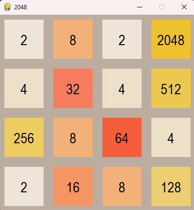
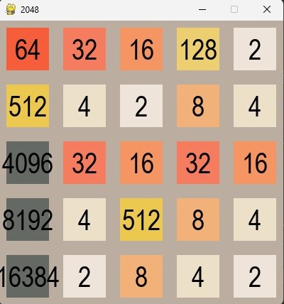

# AI Solver for 2048

## Introduction

This project aims to develop an AI solver for the game 2048 using heuristic algorithms. The motivation behind this project is to explore heuristic algorithms and their effectiveness in solving complex puzzles like 2048.

## Implementation Details

The AI solver is implemented in Python, leveraging the `numpy` library for efficient array manipulations and a custom `Grid` class to manage the game state. The core of the solver revolves around predicting the next best move based on heuristic evaluations of the game grid.

### Operational Logic

1. **Initialization**: Upon instantiation, the solver initializes the game grid using the specified size, defaulting to a 4x4 grid, which is typical for 2048.
2. **Move Prediction**: The `next_move_predictor()` method generates a score for each possible move (up, down, left, right) by copying the grid, applying the move, and evaluating the resulting grid using a scoring function.
3. **Heuristic Scoring**: The scoring is based on multiple heuristics, including the configuration of tiles in a snake-like pattern, the number of adjacent tiles with the same value, and the count of empty tiles.
4. **Expectimax Algorithm**: An advanced version of the AI could incorporate the expectimax algorithm to simulate deeper game plays, considering both the deterministic game mechanics and the probabilistic nature of new tile appearance.

### Heuristic Effectiveness

- **Snake Pattern Scoring**: Awards higher scores to game states where high-value tiles are arranged in a snake-like pattern.
- **Adjacent Tiles Scoring**: Encourages moves that cluster similar tiles together.
- **Empty Tiles Count**: Indicates a healthier game state with more possibilities for movement and tile combination.

## Results

## Conclusion

The implementation of heuristic-based strategies within the AI solver for 2048 demonstrates a significant improvement in game performance, aligning with the project's aim to develop an effective AI solution for complex puzzle games. The modular and expandable nature of the solver's design also allows for the easy integration of additional heuristics or alternative algorithms such as deep learning models in the future.
